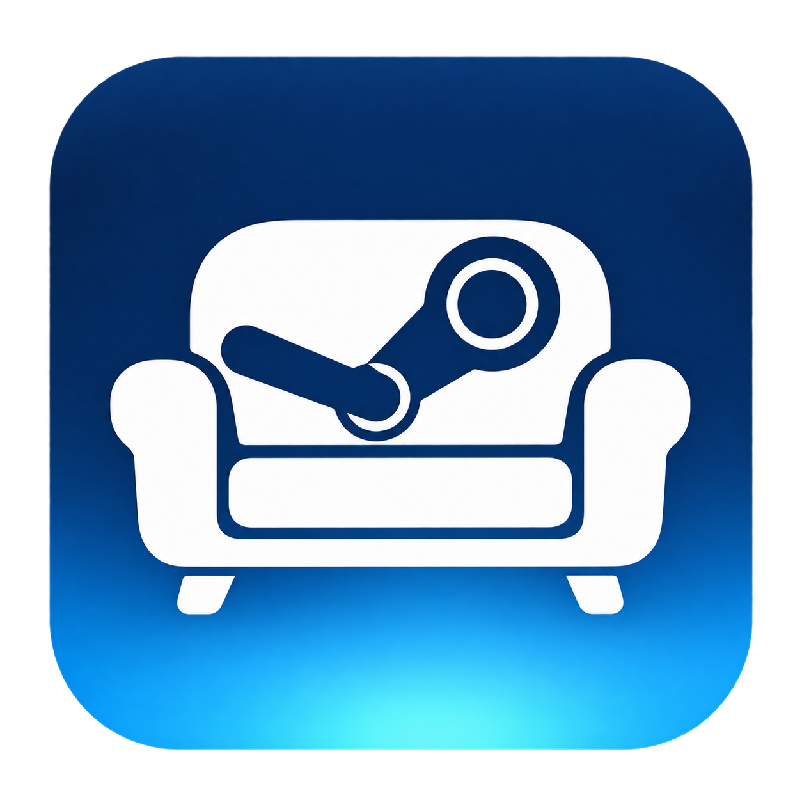

# SteamCouch

<p align="center"></p>

**Your TV, your audio, and your gaming launcher. One shortcut.**

SteamCouch is a small Windows tray app for moving between desktop use and couch
gaming. It reconnects your selected TV, makes it the main display, switches
playback audio, and opens your choice of Steam Big Picture or Xbox mode. Press the same shortcut again to
exit the selected mode and restore your previous display layout and audio devices.
Steam stays running.

## Download

**[Download the latest Windows release](https://github.com/AymanFE/SteamCouch/releases/latest)**

Choose `SteamCouch-v1.9.0-setup-x64.exe` for installation, or `SteamCouch-v1.9.0-windows-x64.zip` for a portable copy. Both include CEC and Google TV software. You do not need the
"Source code" downloads unless you want to build or modify the app.

1. Run the installer, or extract the whole ZIP to a writable folder such as Documents.
2. Open `SteamCouch.exe`.
3. Follow the first-run setup wizard, or open **TV & audio** and select your TV and audio output. Automatic audio works when the TV name matches, or exactly one playback output becomes available when the TV connects.
4. In **Settings**, choose **Steam Big Picture** or **Xbox mode** under **Launch gaming mode**, then click **Save settings**. Open **Home** and choose **Activate TV mode**, or press **Ctrl + Alt + F12**.
5. Press the shortcut again to exit gaming mode and return to your desktop.

The shortcut can be changed. Closing the window keeps SteamCouch running in the
system tray. Right-click its tray icon for settings, restore, or quit. Starting
with Windows is optional and off by default.

The build is unsigned, so Windows may identify it as an unknown publisher.
Download it from this repository's Releases page; a SHA-256 checksum file is
provided alongside the ZIP.

## Features

- Choose your TV and playback device, with a four-step setup wizard and optional TV/desktop round-trip test.
- Toggle TV mode with a customizable controller button combination held for 1–5 seconds, including View/Select + Xbox button on compatible drivers.
- Open a controller-operated TV quick menu with View/Select + Y (or A/B/X): volume, mute, audio output, HDR, resolution/refresh rate, Windows VRR assistance, and desktop return.
- Confirm HDR and resolution changes within 20 seconds or automatically restore the previous setting. Pending changes recover after a restart.
- Save TV HDR and Windows VRR preferences in display profiles; restore previous preferences on desktop return.
- Optionally keep the PC and display awake only during TV mode.
- Save and switch display/audio/launcher profiles.
- Check GitHub for updates, install with settings preserved, and optionally update automatically while idle.
- Run troubleshooting checks and export a report without device IDs or account paths.
- Test controller buttons without firing shortcuts; enable individual Select + A/B/X/Y actions for volume, mute, desktop return, or confirmed sleep.
- Optionally return to desktop after Steam Big Picture or Playnite fullscreen closes, with a grace period and launcher-child game/app checks.
- Optionally show Sleep in the quick menu; desktop restoration must finish successfully first.
- Optionally apply per-game HDR/resolution/refresh profiles in TV mode, matching each game's full executable path.
- Keep the other monitors on, or use only the TV.
- Choose Steam Big Picture, Windows 11 Xbox mode, or Playnite fullscreen, with the selected TV made primary before launch.
- Exit the selected gaming mode before restoring desktop displays and audio.
- Restore monitor positions, resolutions, refresh rates, primary display, and the three previous playback defaults.
- Recover a saved desktop setup after restarting SteamCouch.
- Customize the shortcut, Steam location, device wait time, and Windows startup option.
- Dark interface with light-blue accents, native DPI scaling, and a centered Home layout when maximized.

## Requirements and behavior

- Windows 10 or Windows 11, **64-bit**, with .NET Framework 4.8.
- Steam installed and signed in for automatic Big Picture launching.
- A powered-on TV connected to the PC, with its correct HDMI/display input selected.
- An extended-desktop setup. Mirrored/duplicated displays are not supported.

"Reconnect" means enabling a display that Windows has disconnected in Display
Settings. The app cannot reconnect an unplugged cable or reliably power on a TV.

SteamCouch changes playback defaults, not microphone settings. Its TV quick menu also lets you adjust the current playback output volume and mute. Those explicit volume changes remain saved.
Games with a fixed audio-output preference may need to be set to the Windows
default output. Running games are not force-closed. If a game or Steam dialog
prevents Big Picture from exiting, finish it and retry **Restore desktop**.

Tested on one Windows PC with multiple monitors and an HDMI TV; behavior may
vary by GPU driver, monitor sleep behavior, and Steam configuration.

## TV quick menu

While TV mode is active, hold **View/Select + Y** for about half a second. Use the D-pad or left stick to navigate, **A** to select and **B** to return to the game. On the Volume tile, Left/Right changes volume in 5% steps and X toggles mute. Keyboard arrows, Enter, Escape, mouse clicks and the wheel also work. Settings lets you disable the menu, change its chord to View + A/B/X, or preview it without changing hardware.

The menu opens on the TV saved for the current session. It works best with borderless/windowed games and Steam Big Picture. Opening it takes focus; exclusive-fullscreen games may minimize. SteamCouch does not inject code into games or block controller input from reaching them.

HDR availability is checked for the TV's current connection. Resolution and refresh choices come from the Windows driver, with a 20-second confirmation and automatic rollback. A separate watchdog can revert even if the UI stalls. The original desktop layout and HDR preference are retained for desktop return; a failed recovery keeps its restore file for retry.

**Windows VRR assistance** is the Windows-wide preference for games without native VRR support. It is not a TV-specific G-SYNC/FreeSync switch and does not prove VRR is active. Enable compatible VRR on the TV and in GPU settings too. Restart the game after changing this preference. SteamCouch preserves other GPU preference entries and restores the previous VRR entry on desktop return.

**View/Select + Xbox** can be selected for entering and leaving TV mode. Guide-button detection depends on the controller and Windows driver; Steam and Windows may still respond to that button. View + Menu + LB + RB remains the reliable default fallback. Shortcuts require release before firing again.

## Optional couch features

Every new automatic feature is **off by default**, and upgrading preserves your existing preferences. Open Settings, scroll to the couch options, enable only what you want, and click **Save settings**.

- **Additional controller actions:** each of three slots has an independent switch, button choice and action. New actions work in TV mode. Enabled shortcuts cannot overlap. Use **Test controller** to see live buttons, triggers and stick movement; shortcuts pause while the tester is open.
- **Automatic desktop return:** opt in for Steam Big Picture or Playnite fullscreen. SteamCouch must first observe the launcher, waits at least eight seconds after it closes, and waits while launcher-child apps appear active. This is conservative: background apps launched from the gaming launcher may require a manual desktop return. Xbox mode continues to use manual restoration.
- **Sleep:** opt in to show it in the quick menu. A second confirmation is required. SteamCouch restores desktop displays/audio/video preferences first and does not sleep if restoration fails. Disabling Sleep also disables any Sleep shortcut. Games are never force-closed.
- **Per-game profiles:** enable the master option in Settings and enable each desired game separately in Profiles. Choose the actual game .exe, not its launcher. The profile applies only during TV mode when exactly one enabled game is detected, and changes require confirmation within 20 seconds. Previous TV-session settings restore when the game closes or the master option is disabled. Rejected changes are not retried until the game exits. Enable TV mode while editing if you need its supported resolution/refresh choices. Protected games that prevent executable-path inspection may not be detected.
- **Playnite:** choose Playnite fullscreen as the launcher, select its program in Settings, and save. SteamCouch uses Playnite's supported fullscreen/desktop commands. Playnite is neither installed nor launched unless selected. Returning to desktop switches Playnite to desktop mode; it does not terminate games.

## Troubleshooting

- **TV is missing:** turn it on, select the PC input, and click **Refresh devices**. Check Windows Display Settings and the cable if needed.
- **Audio selection is ambiguous:** temporarily extend the TV in Windows, refresh devices, and explicitly choose its audio output.
- **Steam uses another screen:** set Steam's preferred display to Automatic/Primary and try again.
- **Shortcut is occupied:** choose another modifier/key combination and save.
- **Restore fails:** reconnect the original monitors/audio devices and retry **Restore desktop**. Keep the `data` folder: it contains the saved restore point.

For troubleshooting, run `SteamCouch.exe --diagnose`. Device details and logs are
written locally under `data`. They may contain device identifiers and local
paths, so review them before attaching them to a public issue.

## Build from source

Clone or download this repository. From Windows PowerShell in its folder:

```powershell
.\build.ps1
.\build\SteamCouch\SteamCouch.exe
```

The build uses the .NET Framework compiler included with Windows. No .NET SDK,
Node.js, Python, or third-party build package is required. The two bundled
NirSoft archives are extracted locally; the build does not download tools.

To build, test, and package a release:

```powershell
.\package.ps1
```

The ZIP and its SHA-256 checksum are written to `dist`. Packaging uses an
explicit file list; personal settings, logs, restore points, and diagnostics
are never included. Automated orchestration tests use fake devices and do not
switch your hardware. Hardware testing is separate and opt-in.

## Local data and updates

Keep the executable, `SteamCouch.exe.config`, `assets`, and `tools` together. Settings and restore points
are stored beside the executable in `data`; the app makes no analytics or telemetry requests. Optional update checks contact GitHub for public release information.
Return to desktop mode and quit SteamCouch before replacing the program files.
Keep your `data` folder to preserve your settings.

## License

SteamCouch's original code is licensed under [MIT](LICENSE). The bundled NirSoft
utilities keep their own freeware terms; see [third-party notices](THIRD-PARTY-NOTICES.md).
SteamCouch is a community utility, not an official Valve product.

The Start with Windows switch applies immediately and launches into the system tray at sign-in. Keep SteamCouch.exe.config beside the executable for native per-monitor DPI scaling.

## Xbox mode
Xbox mode requires a supported Windows 11 installation and the Xbox app. Enable Xbox mode under Windows Settings > Gaming first; confirm Win + F11 enters and exits it. SteamCouch uses that Windows shortcut and verifies the mode through Windows'' gaming-experience API. It checks that the Xbox window is full screen on the selected primary TV. Xbox mode may cover secondary screens even when SteamCouch keeps them connected. SteamCouch does not install feature enablers or change Windows'' Xbox-mode configuration. Win + F11 cannot also be used as SteamCouch''s shortcut for Xbox mode.

## Controller overlays

In Settings, enable **Disable Game Bar & Controller Bar** to stop Windows overlays opening alongside Steam's menu when you press the controller's Xbox/Guide button. It also stops Controller Bar appearing when you connect a controller. The switch applies immediately for the current Windows user; Win + G still opens Game Bar. Turning the switch off enables the three controller triggers again.

SteamCouch updates Windows' Game Bar shortcut and Game Bar's own Controller Bar preferences using the Windows app-data API, then notifies running components. It checks the current settings at startup. Keep `tools/windows/controller-overlays.ps1` with the app; it runs through Windows' included PowerShell without opening a console. Game Bar must be installed to manage its Controller Bar preferences. These app-specific preference names may change in future Game Bar versions.

## Controller shortcut and keep awake

Enable **Controller shortcut** in Settings and save. The default is **View + Menu + LB + RB**, held for **2 seconds**. Hold it to enter TV mode, release all buttons, then hold it again to restore desktop. You can choose a different combination and a hold duration from 1 to 5 seconds. SteamCouch must be running; this does not power on the computer. Xbox/XInput-compatible controllers are supported, including compatible virtual controllers. The shortcut is not captured away from games, so choose a combination you do not use in gameplay. Switching, setup dialogs, and update installation suppress the shortcut and require a fresh release before rearming.

**Keep PC and TV awake in TV mode** is off by default. Enable and save it to prevent idle sleep and display timeout during TV sessions. Returning to desktop, disabling it, or quitting the app releases the temporary request. It does not change your Windows power plan or prevent deliberate sleep, locking, or shutdown.

## Profiles, setup, and help

**Profiles** saves the selected display, playback audio, gaming launcher, Steam path, and other-monitor behavior. Name a setup and choose **Save current setup**. Saving the same name replaces that profile. **Use profile** applies and saves it in desktop mode; activate TV mode separately. Global controller, startup, update, and keep-awake preferences stay unchanged.

Open **Help & updates** to rerun the setup wizard or choose **Troubleshoot**. The wizard supports selecting Steam's location and an optional test that enters TV mode and restores your desktop. The troubleshooting report is shown for review before export and includes device names, without device IDs, account names, or local file paths.

## Updates

Automatic update checks are on by default and happen at most once a day while SteamCouch runs. **Check for updates** also works manually. **Install automatically while idle** is optional and off by default; save your preferences to apply them. It installs only in desktop mode, with Big Picture closed, the app hidden in the tray, no open setup dialogs, and at least a minute without keyboard/mouse/controller input. Automatic installs return to the tray.

Only newer stable releases from AymanFE/SteamCouch are considered. Downloads are checked against GitHub's SHA-256 asset digest; archive paths and required files are validated. Updates preserve `data` and keep the previous files under `data/update-backups`. A failed install or startup restores the previous files. Internet errors leave the installed app working. This uses the Windows PowerShell included with Windows; no GitHub login is required. Keep both scripts in `tools/windows` with the executable.

## Automatic TV power and HDMI input

Under **TV & audio**, optionally enable **Turn on TV & select HDMI automatically**. CEC software and its C++ runtime are included and selected automatically in both distributions. Choose the PC's HDMI input (HDMI 1 by default), a wake delay and save. SteamCouch sends power-on and active-source requests before changing Windows displays. Each saved display profile includes these preferences; the bundled software selection remains portable when you move the folder.

A libCEC-compatible physical CEC interface is still required. Most GPU HDMI outputs lack CEC, so a compatible USB-CEC adapter is commonly needed. Enable CEC on your TV. For Google TV / Android TV, you can instead use the network option described below.

**Test TV power & input** sends real commands without changing your Windows display layout. Check that your TV honors the request. **Set up adapter driver** launches the included official driver installer if needed and may require Windows permission. The installer has the same optional driver task. Neither distribution installs drivers automatically. Other CEC apps can occupy the adapter; close them if it is busy. Desktop return leaves the TV on by default.

For 4K/120 Hz, check adapter bandwidth before placing it in the video path. Pulse-Eight documents a [spare-HDMI-port arrangement](https://support.pulse-eight.com/support/solutions/articles/30000053070/thumbs_up); active-source addressing must point to the PC's video input. Receiver/soundbar chains can need additional configuration.

## Windows installer and portable build

Use `SteamCouch-v1.9.0-setup-x64.exe` for a per-user installation, Start menu shortcut and uninstaller, or extract the portable ZIP and run SteamCouch.exe. Both contain the same CEC client, native library, app-local C++ runtime, driver installer, notices and corresponding native source. Windows 10 version 2004 or newer / Windows 11 supplies .NET Framework 4.8 and the Universal CRT. A separate .NET 8 installation is not needed.

The installer preserves app data on upgrade/uninstall and blocks replacement while SteamCouch is running or a saved TV restore point is active. Return to desktop mode and exit the tray app before installing an upgrade.

After running `package.ps1`, build the setup executable with `scripts/build-installer.ps1 -Compiler <path-to-ISCC.exe>` using Inno Setup 7. CEC and ADB vendor archive hashes are checked during every build. No compiler or development tools are needed by end users.
## Google TV / Android TV network control

The setup wizard includes an optional TV power and HDMI step. Enter your own TV IPv4 address under **Set up Google TV**; it remains editable in **TV & audio**. This option is off by default and needs no CEC adapter. Google TV network control and CEC are alternatives; enabling one disables the other.

1. Enable Developer options and USB/network debugging on your TV. Put the TV and PC on the same trusted home network.
2. Enter its IP address (older network debugging normally uses port 5555). If Wireless debugging shows a connection port, enter IP:port.
3. For Wireless debugging, choose **Pair with code** and enter the pairing address/port and six-digit code shown on the TV. The pairing port differs from the connection port. Then use **Connect / authorize** with the connection address, and allow this PC on the TV.
4. Choose the PC's HDMI input, enable the network option and save. **Test TV power & input** sends real wake/input commands without changing Windows displays.

ADB 37.0.1 and its native Windows dependencies/notices are included in both distributions. SteamCouch uses a separate local ADB server port (5039) and an app-specific key directory. Pairing codes are not saved. Display profiles retain these TV preferences.

Activation sends wake (not a power toggle), waits, and selects HDMI before changing Windows displays. A connection/command failure stops activation and leaves your desktop unchanged. Returning to desktop leaves the TV on unless the optional network-control standby setting is enabled.

Wake from standby requires the TV to keep its network/debugging service available, often using network standby or TCL's Screenless service. An optional MAC address sends a Wake-on-LAN packet if your TV supports it. A fully powered-off TV cannot be guaranteed to wake over the network. HDMI input key support varies by firmware; an optional Android passthrough input URI is available for models that ignore HDMI keys. SteamCouch cannot infer a model-specific URI reliably. Use only your own TV's input URI.

Do not forward debugging ports to the internet. You can revoke this PC's authorization in the TV's Developer options.
## Other monitors during TV mode

Choose a behavior under **TV & audio → Other monitors during TV mode**, or in the setup wizard:

- **Leave other monitors on:** keep using them normally.
- **Disconnect other monitors:** Windows disables them during TV mode and restores the saved layout on return.
- **Turn off other monitors (DDC/CI):** send a targeted power command to supported monitors, leaving the TV on. Enable DDC/CI in each monitor's own menu. The app records the previous power state before sending commands and wakes the monitors before restoring Windows displays. Firmware can disconnect powered-off screens or refuse wake requests; use the monitor's power button and retry restoration if needed.
- **Black screens — keep connected:** cover other connected monitors with borderless black windows. This does not change brightness or disconnect displays. Covers disappear on desktop return; double-click any cover (or use the controller/keyboard shortcut) to return. The covers follow display layout changes and exclude the TV.

Existing preferences migrate to Leave on or Disconnect. Profiles retain the new choice. Hardware power changes and recovery are recorded in the TV session for restart recovery. Black covers are owned by SteamCouch and disappear if the app exits.

## Turn off the TV on desktop return

Under **TV & audio → Google TV**, optionally check **Turn off TV when returning to desktop**. It is off by default and only available when Google TV network control is enabled; the wizard has the same choice. It applies to the next TV session.

The selected TV address is saved with that session. After the gaming launcher closes and desktop display/audio restoration succeeds, SteamCouch sends the TV a standby command (not a power toggle). An activation rollback, incomplete restore, or desktop-only Restore command does not send standby. If TV standby fails, the restored desktop remains usable and the app reports the TV failure. Network authorization and firmware support are required. The existing standby-wake requirements still apply when entering TV mode again.